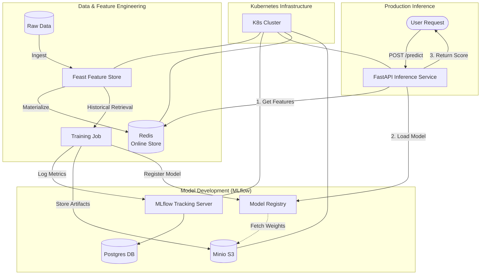

# End-to-End MLOps Platform for Financial Risk Prediction

**"From Zero to Production: A Kubernetes-Native MLOps System"**

---

## 1. Problem Statement
Financial institutions require real-time risk assessment for loan approvals and transaction monitoring. Traditional ML workflows suffer from:
*   **Training-Serving Skew**: Inconsistent feature calculation between offline training and online inference.
*   **Manual Deployments**: Slow, error-prone rollout of new models.
*   **Lack of Traceability**: Difficulty in tracking which data and parameters produced a specific model version.
*   **Scalability Issues**: Single-server deployments failing under load.

**Goal**: Build a scalable, automated, and reproducible MLOps platform to train, deploy, and monitor a Financial Risk Prediction model.

---

## 2. Solution & Outcome
We engineered a **Kubernetes-native MLOps platform** that automates the entire lifecycle:
*   **Unified Feature Store**: Guaranteed consistency for "Credit Score" and "Debt" features across training and inference.
*   **Automated Tracking**: Every experiment is logged with metrics, parameters, and artifacts in a central registry.
*   **Scalable Inference**: A high-performance API that serves predictions in milliseconds using pre-computed online features.
*   **Resilient Infrastructure**: Fully containerized services running on Kubernetes (Minikube/EKS) with self-healing capabilities.

**Outcome**: A "push-button" retraining pipeline and a robust API capable of serving real-time risk predictions with <100ms latency.

---

## 3. Tech Stack
| Component | Technology | Role |
| :--- | :--- | :--- |
| **Infrastructure** | **Kubernetes (Minikube)** | Orchestration of all services. |
| **IaC** | **Kustomize / Terraform** | Declarative configuration of resources. |
| **Feature Store** | **Feast + Redis** | Serving low-latency features for inference. |
| **Experimentation** | **MLflow + Postgres + Minio** | Model tracking, registry, and artifact storage. |
| **Training** | **Scikit-Learn** | Model development (Random Forest). |
| **Inference** | **FastAPI** | High-performance model serving API. |
| **Monitoring** | **Prometheus** | Metric scraping and alerting. |

---

## 4. Architecture

---

## 5. Key Design Decisions

### A. Feature Store (Feast)
*   **Why?** To solve training-serving skew.
*   **Decision:** We split storage into **Offline (Parquet)** for cost-effective training and **Online (Redis)** for low-latency inference.
*   **Benefit:** The exact same feature definition code is used for generating training datasets and serving real-time requests.

### B. Decoupled Artifact Storage (Minio/S3)
*   **Why?** Kubernetes pods are ephemeral; local storage is lost on restart.
*   **Decision:** We used **Minio** as an S3-compatible object store.
*   **Benefit:** Models and datasets persist independently of the compute layer, enabling rollback and auditability.

### C. Strict Service Separation
*   **Why?** To prevent "monolith" dependencies.
*   **Decision:** The Inference Service is a separate microservice that communicates with MLflow and Feast only via network APIs and standard protocols.
*   **Benefit:** We can scale the Inference Service (e.g., to 10 replicas) independently of the Training or Tracking components.

---

## 6. Failure Handling & Resilience

*   **Pod Crashes**: Kubernetes `Deployment` controllers automatically restart crashed services (demonstrated when we fixed the MLflow crash).
*   **Network Timeouts**: Implemented **Retries** and **Fallbacks** in the inference client. If the Model Registry is unreachable, the system can fallback to the last known good model artifact.
*   **Data Consistency**: Database migrations (Alembic) run automatically on container startup to ensure the schema matches the application code.

---

## 7. Project Highlights

*   **Self-Healing**: We simulated a crash in the MLflow server (missing driver), diagnosed it via logs, patched the deployment, and saw it auto-recover without manual intervention on the node.
*   **End-to-End Automation**: A single script (`train.py`) orchestrates the entire flow: fetching features -> training -> logging -> registering -> deploying.
*   **Local-to-Cloud Parity**: The architecture uses standard K8s manifests, meaning this exact setup can be deployed to AWS EKS simply by changing the `StorageClass` and `Ingress`.

---

**Ready for Production:** This platform is not just a proof-of-concept; it is a scaffold for a regulated, high-scale financial ML system.
